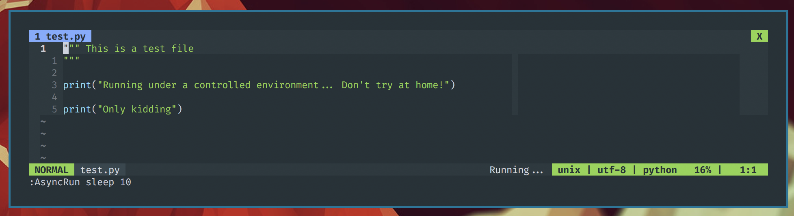

# lightline-asyncrun

This plugin allows you to add a simple indicator on the vim's lightline to see 
if there is any async job running in the background.



# Installation

You can install it using the Vim's plugin manager of your choice.
For example with [Vundle](https://github.com/VundleVim/Vundle.vim):

```viml
" Dependencies
Plugin 'itchyny/lightline.vim'
Plugin 'skywind3000/asyncrun.vim'
" Plugin
Plugin 'albertomontesg/lightline-asyncrun'
```

# Integration with lightline

1. Register the component:

```viml
let g:lightline.component_expand = {
        \ 'asyncrun_status': 'lightline#asyncrun#status',
        \ }
```

2. Add the components to the lightline:

```viml
let g:lightline.active = {
\ 'right': [
\	  ['percent', 'lineinfo'],
\	  ['fileformat', 'fileencoding', 'filetype'],
\   ['asyncrun_status']
\ ]}
```

# Configuration

### `g:lightline#asyncrun#indicator_none`

The indicator where there is no jobs running. Default is `No Jobs`.

### `g:lightline#asyncrun#indicator_run`

The indicator where there is one job running. Default is `Running...`.


# Aknowledgements

This plugin is completely inspired by the plugin [lightline-ale](https://github.com/maximbaz/lightline-ale) by [Maxim Baz](https://github.com/maximbaz).

# License

[MIT](https://github.com/albertomontesg/lightline-asyncrun/blob/master/LICENSE)
